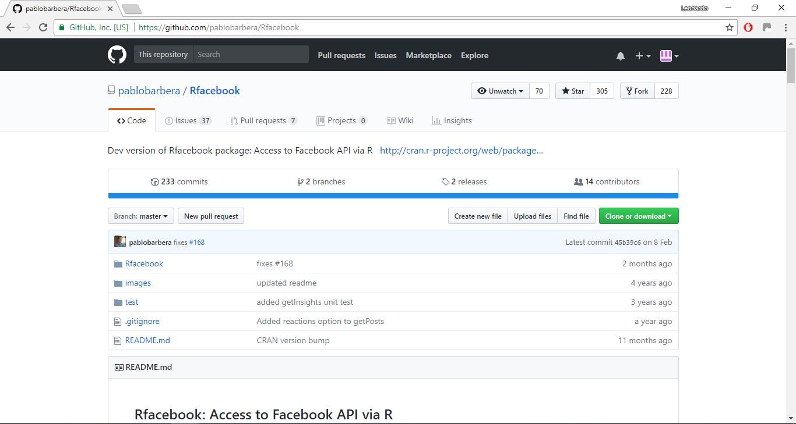
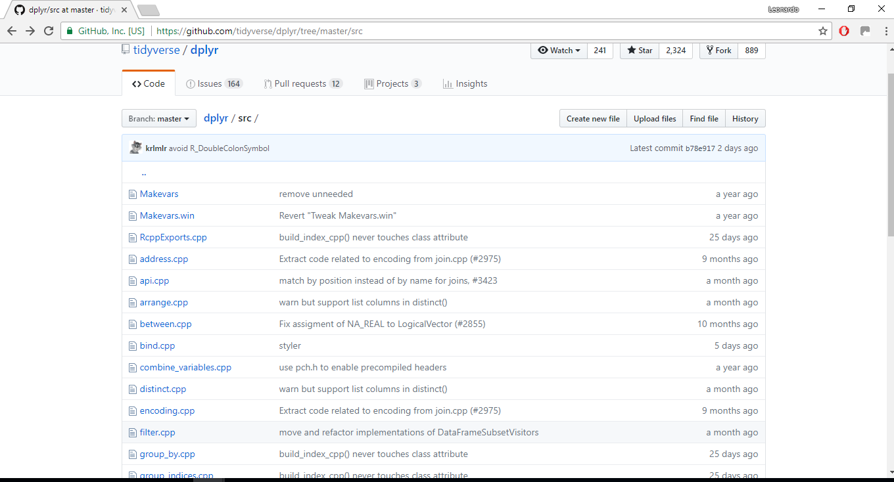
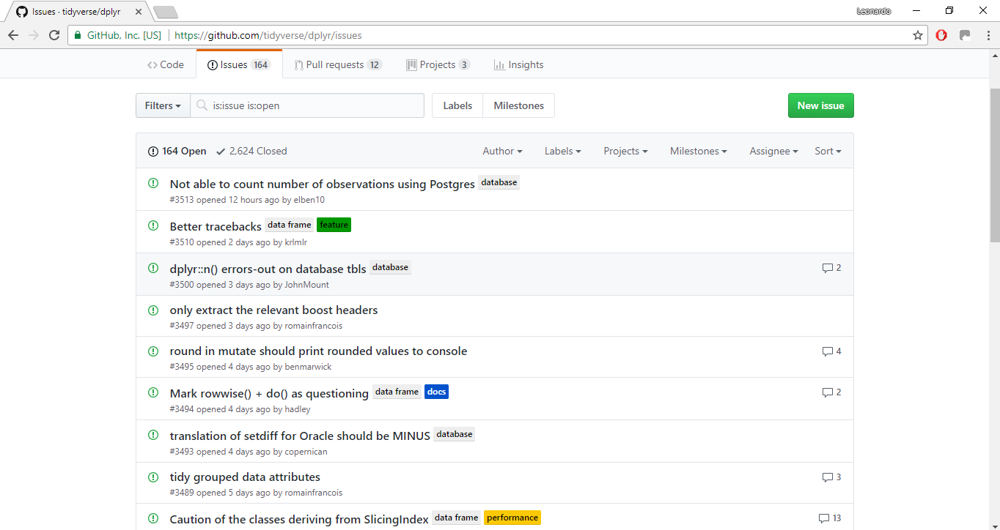
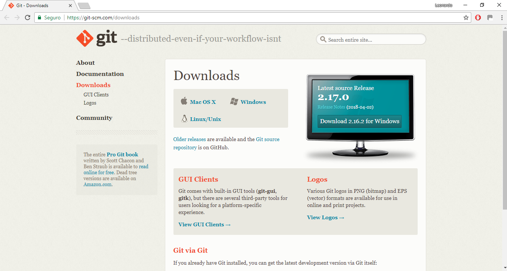
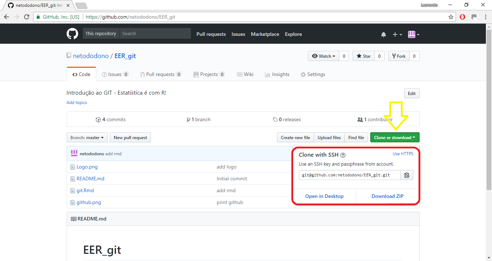
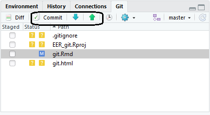
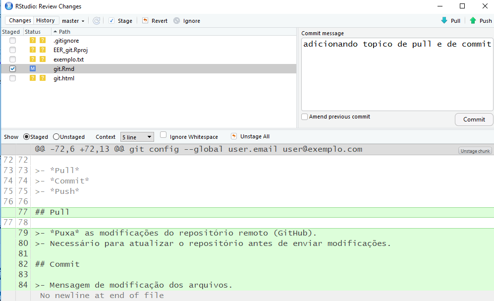
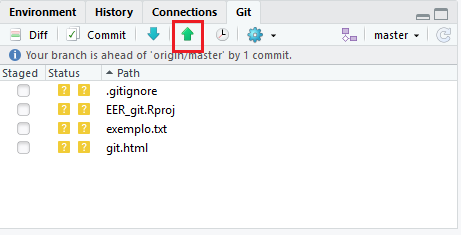

## O que é o [GitHub](https://github.com/)?  

>- Hospedagem gratuita para *repositórios*.
>- Permite criar e manter repositórios.
>- Incentiva colaboração.

>- 

## Uso do github

### Código

>- 

## Uso do github

### Problemas 

>- 


## O que é o GIT?  

>- Sistema de controle de versão.
>- Software livre.
>- Permite o *clone* de  repositório remoto.
>- Permite alteração de repositório remoto.

## [Download](https://git-scm.com/downloads)



## Configurando o GIT

### Definindo a identidade

Em **Git Bash**, digitamos:

```{r, engine='bash', eval = F}
git config --global user.name "nome_de_usuario"
git config --global user.email user@exemplo.com
```

## Clonando projeto

### Obtendo url



## Clonando projeto

### Utilizando o RStudio

>- Abra um novo projeto.
>- Selecione *Version Control*.
>- Escolha *Git*.
>- Cole a *url* do repositório.

## Fazendo e obtendo modificações



>- *Pull*
>- *Commit*
>- *Push*

## Pull

>- *Puxa* as modificações do repositório remoto (GitHub).
>- Necessário para atualizar o repositório antes de enviar modificações.

## Commit

>- Mensagem de modificação dos arquivos.

>- 

## Push

>- Envia os commits ao repositório remoto (se for autorizado pelo mantenedor).
>- Importante o reposítório estar atualizado.

>- 